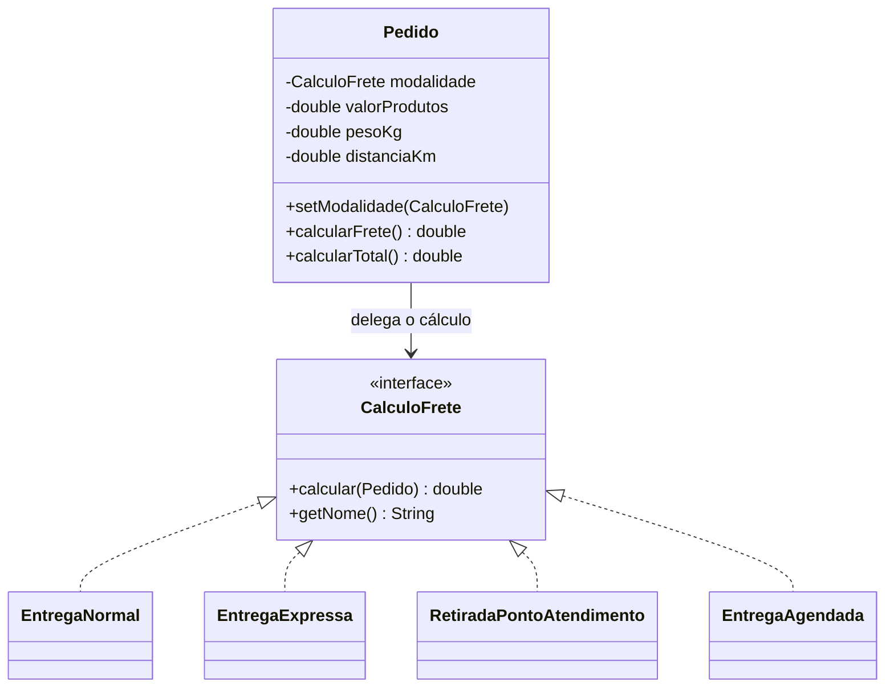

# Questão 1 — Cálculo de Frete (Strategy)

## 1. O problema

Uma loja virtual calcula o frete de três modalidades (normal, expressa, retirada em ponto de atendimento), cada uma com uma regra diferente. Novas modalidades (agendada, internacional) serão criadas no futuro.

Hoje a classe `Pedido` acumula as regras de todas as modalidades. O código costuma ficar assim:

```java
public double calcularFrete() {
    if (tipo.equals("NORMAL"))        { return 10 + km * 0.05 + kg * 1.0; }
    else if (tipo.equals("EXPRESSA")) { return 25 + km * 0.12 + kg * 2.5; }
    else if (tipo.equals("RETIRADA")) { return 0; }
    // toda nova modalidade exige editar este método...
}
```

Isso gera três problemas:

| Problema | Consequência |
|---|---|
| `Pedido` conhece as regras de todas as modalidades | Baixa coesão: a classe mistura "dados do pedido" com "regras de frete" |
| Cada nova modalidade obriga a alterar `Pedido` | Viola o **Princípio Aberto/Fechado (OCP)** |
| Cadeia de `if/else` cresce sem parar | Difícil de testar e de manter |

## 2. Padrão identificado: **Strategy**

> *Define uma família de algoritmos, encapsula cada um deles e os torna intercambiáveis. O Strategy permite que o algoritmo varie independentemente dos clientes que o utilizam.*

**Por que Strategy?** O enunciado descreve exatamente o cenário do padrão: existem **várias formas de fazer a mesma coisa** (calcular frete), a forma deve ser **escolhida e trocada em tempo de execução**, e **novas formas** devem entrar com pouca alteração no sistema.

## 3. Papéis do padrão no código

| Papel no Strategy | Classe | Responsabilidade |
|---|---|---|
| **Strategy** (interface) | `CalculoFrete` | Contrato comum: `calcular(Pedido)` e `getNome()` |
| **ConcreteStrategy** | `EntregaNormal`, `EntregaExpressa`, `RetiradaPontoAtendimento`, `EntregaAgendada` | Cada uma encapsula **uma** regra de cálculo |
| **Context** | `Pedido` | Guarda uma referência a `CalculoFrete` e **delega** o cálculo |
| **Client** | `FreteConsole` | Escolhe qual estratégia entregar ao pedido |

## 4. Diagrama de classes



## 5. Como a solução funciona (passo a passo)

1. O cliente cria um `Pedido` com valor dos produtos, peso e distância.
2. O cliente escolhe uma estratégia e a entrega ao pedido: `pedido.setModalidade(new EntregaExpressa())`.
3. Ao chamar `pedido.calcularFrete()`, o pedido **não calcula nada**: ele apenas executa `modalidade.calcular(this)`.
4. A estratégia lê os dados do pedido (peso, distância) e aplica a **sua** regra.
5. Para mudar de modalidade basta chamar `setModalidade(...)` de novo. `Pedido` não é modificado.

```java
Pedido pedido = new Pedido(1, 250.00, 3.0, 120.0);
pedido.setModalidade(new EntregaNormal());
pedido.calcularFrete();                    // 19.00
pedido.setModalidade(new EntregaExpressa());
pedido.calcularFrete();                    // 46.90 (troca sem alterar Pedido)
```

## 6. Requisitos do enunciado × solução

| Requisito da tarefa | Como foi atendido |
|---|---|
| Utilizar diferentes formas de cálculo | Uma classe por modalidade, todas implementando `CalculoFrete` |
| Escolher a modalidade de entrega de um pedido | `Pedido.setModalidade(...)` recebe a estratégia escolhida |
| Trocar a modalidade sem modificar `Pedido` | `Pedido` depende só da **interface**, nunca de classes concretas |
| Adicionar novas modalidades com poucas alterações | Basta criar **uma classe nova**. `EntregaAgendada` foi adicionada para provar isso |

## 7. Princípios de projeto aplicados

- **OCP (Aberto/Fechado):** aberto para extensão (novas estratégias), fechado para modificação (`Pedido` não muda).
- **SRP (Responsabilidade Única):** `Pedido` cuida do pedido; cada estratégia cuida de uma regra.
- **DIP (Inversão de Dependência):** `Pedido` depende da abstração `CalculoFrete`, não de implementações.
- **Composição sobre herança:** o comportamento é *composto* no pedido, não herdado.

## 8. Como adicionar uma nova modalidade (ex.: internacional)

```java
public class EntregaInternacional implements CalculoFrete {
    public double calcular(Pedido p) { return 80 + p.getPesoKg() * 15; }
    public String getNome() { return "Entrega internacional"; }
}
// uso: pedido.setModalidade(new EntregaInternacional());
```

Nenhuma outra classe precisa ser alterada.

## 9. Saída esperada

```
Entrega normal                     frete: R$   19.00 | total: R$  269.00
Entrega expressa                   frete: R$   46.90 | total: R$  296.90
Retirada em ponto de atendimento   frete: R$    0.00 | total: R$  250.00
Entrega agendada                   frete: R$   26.50 | total: R$  276.50
```

Executar somente esta questão: `java -cp target/classes br.edu.prova.apresentacao.Main 1`
