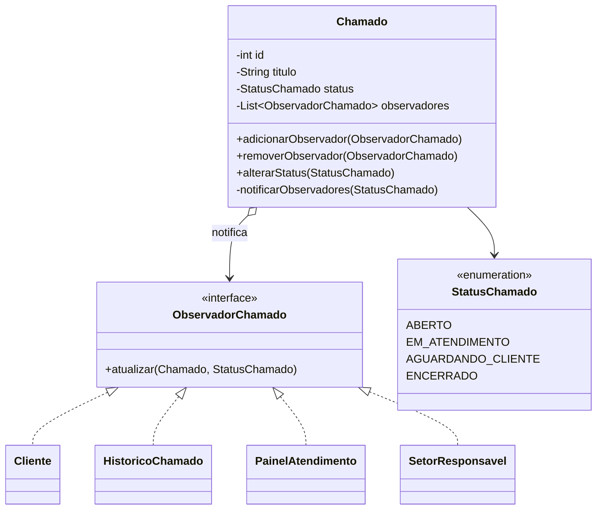
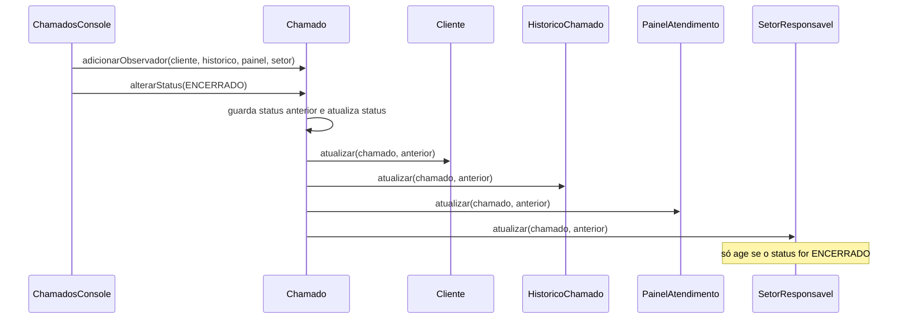

# Questão 2 — Sistema de Chamados (Observer)

## 1. O problema

Quando o status de um chamado muda (por exemplo, é encerrado), várias partes do sistema precisam saber:

- o **cliente** deve ser informado;
- o **histórico** deve ser atualizado;
- o **painel de atendimento** deve refletir a nova situação;
- o **setor responsável** pode precisar ser notificado.

Além disso: **nem todos os componentes acompanham todos os chamados**, e **novos mecanismos de acompanhamento** poderão ser acrescentados depois.

**O problema atual:** a classe responsável pelo chamado possui conhecimento direto sobre todos os componentes que precisam ser informados.

**A tarefa pede uma solução que permita:**

- cadastrar componentes interessados nas alterações;
- remover componentes que não desejam mais receber informações;
- informar vários componentes quando uma alteração ocorrer;
- adicionar novos componentes sem precisar modificar a classe principal;
- evitar que o chamado conheça detalhes sobre cada componente interessado.

Sem padrão, a classe `Chamado` teria que conhecer e chamar cada componente:

```java
public void encerrar() {
    this.status = ENCERRADO;
    cliente.avisar(this);       // acoplamento direto
    historico.registrar(this);  // acoplamento direto
    painel.atualizar(this);     // acoplamento direto
    setor.notificar(this);      // e se não for necessário para este chamado?
}
```

| Problema | Consequência |
|---|---|
| `Chamado` conhece todas as classes concretas | Alto acoplamento |
| Novo componente exige editar `Chamado` | Viola o OCP |
| Não há como escolher quem acompanha qual chamado | Notificações desnecessárias ou `if`s espalhados |

## 2. Padrão identificado: **Observer**

> *Define uma dependência um-para-muitos entre objetos, de modo que, quando um objeto muda de estado, todos os seus dependentes são notificados e atualizados automaticamente.*

**Por que Observer?** Há um objeto cujo estado muda (o chamado) e um **conjunto variável** de objetos interessados nessa mudança. O enunciado pede exatamente isso: notificar automaticamente, permitir que só alguns acompanhem e aceitar novos acompanhantes no futuro.

## 3. Papéis do padrão no código

Anotação da prova: *entidade observável* = quem tem o estado que muda (o **Chamado**); *entidades observadoras* = quem reage à mudança.

| Papel no Observer | Classe | Responsabilidade |
|---|---|---|
| **Subject** (entidade observável) | `Chamado` | Guarda o status e a lista de observadores; notifica ao mudar de status |
| **Observer** (interface) | `ObservadorChamado` | Contrato: `atualizar(Chamado, StatusChamado statusAnterior)` |
| **ConcreteObserver** (entidades observadoras) | `Cliente`, `HistoricoChamado`, `PainelAtendimento`, `SetorResponsavel` | Cada uma reage do seu jeito |
| **Client** | `ChamadosConsole` | Monta os chamados e decide quem observa o quê |

## 4. Diagrama de classes



## 5. Fluxo de execução



Passo a passo:

1. Cada observador se **inscreve** no chamado que quer acompanhar (`adicionarObservador`).
2. Quando `alterarStatus(novo)` é chamado, o chamado guarda o status anterior, atualiza o status e percorre a lista de observadores.
3. Cada observador recebe `atualizar(chamado, statusAnterior)` e faz o que lhe cabe: o cliente é avisado, o histórico registra, o painel exibe, o setor só reage ao encerramento.
4. Se o novo status for igual ao atual, **ninguém é notificado** (nada mudou).

## 6. Requisitos do enunciado × solução

| Requisito da tarefa | Como foi atendido |
|---|---|
| Cadastrar componentes interessados nas alterações | `Chamado.adicionarObservador(...)` |
| Remover componentes que não desejam mais receber informações | `Chamado.removerObservador(...)`. Na demonstração, o painel deixa de acompanhar o chamado 2 e não é mais notificado |
| Informar vários componentes quando uma alteração ocorrer | `alterarStatus` percorre a lista e chama `atualizar(...)` em **todos** os inscritos |
| Adicionar novos componentes sem modificar a classe principal | Basta criar uma classe que implemente `ObservadorChamado` e inscrevê-la. `Chamado` não muda |
| Evitar que o chamado conheça detalhes de cada componente | `Chamado` só conhece a **interface** `ObservadorChamado`, nunca `Cliente`, `PainelAtendimento` etc. |

Requisitos adicionais do contexto do enunciado:

| Requisito do contexto | Como foi atendido |
|---|---|
| Cliente informado, histórico atualizado, painel refletindo, setor notificado | Quatro observadores concretos, um para cada necessidade |
| Nem todos os componentes acompanham todos os chamados | Cada `Chamado` tem **sua própria lista** de observadores (o chamado 2 só tem histórico e painel) |
| O setor só precisa saber de alguns eventos | `SetorResponsavel` **filtra** dentro de `atualizar` (só reage a `ENCERRADO`) |

## 7. Detalhes de implementação importantes

- **Cópia defensiva** ao notificar (`new ArrayList<>(observadores)`): se um observador se remover durante a notificação, a iteração não quebra (`ConcurrentModificationException`).
- **`adicionarObservador` evita duplicatas**, para o mesmo observador não ser notificado duas vezes.
- **Modelo *push*:** o observador recebe o chamado e o status anterior, então não precisa consultar de volta quem mudou.
- **Baixo acoplamento:** `Chamado` só conhece a interface `ObservadorChamado`.

## 8. Princípios de projeto aplicados

- **OCP:** novos observadores sem alterar `Chamado`.
- **DIP:** `Chamado` depende da abstração, não das classes concretas.
- **Acoplamento fraco:** quem muda o estado e quem reage não se conhecem.

## 9. Como adicionar um novo mecanismo (ex.: notificação por SMS)

```java
public class NotificadorSms implements ObservadorChamado {
    public void atualizar(Chamado c, StatusChamado anterior) {
        System.out.println("SMS: chamado #" + c.getId() + " agora está " + c.getStatus());
    }
}
// uso: chamado.adicionarObservador(new NotificadorSms());
```

## 10. Saída esperada (trecho)

```
-> Chamado 1 e ENCERRADO
  [Cliente Maria] Seu chamado #1 mudou de EM_ATENDIMENTO para ENCERRADO.
  [Historico] Registrado: Chamado #1: EM_ATENDIMENTO -> ENCERRADO
  [Painel] Chamado #1 (Erro ao emitir boleto) agora esta: ENCERRADO
  [Setor Financeiro] Notificacao: chamado #1 foi encerrado.
-> Chamado 2 passa para EM_ATENDIMENTO (cliente e setor nao acompanham)
  [Historico] Registrado: Chamado #2: ABERTO -> EM_ATENDIMENTO
  [Painel] Chamado #2 (Duvida sobre plano) agora esta: EM_ATENDIMENTO
-> Painel deixa de acompanhar o chamado 2 (removerObservador)
-> Chamado 2 e ENCERRADO (so o historico e informado)
  [Historico] Registrado: Chamado #2: EM_ATENDIMENTO -> ENCERRADO
```

Executar somente esta questão: `java -cp target/classes br.edu.prova.apresentacao.Main 2`
