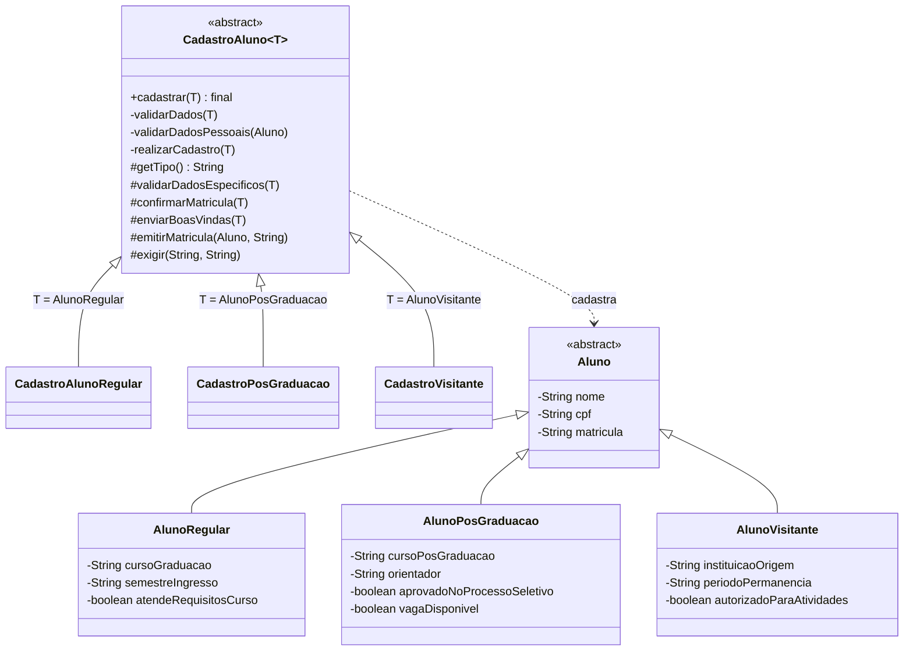
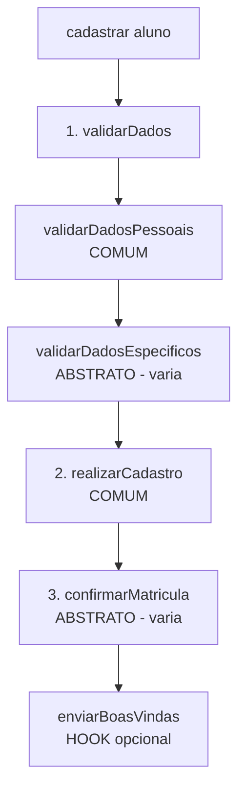

# Questão 3 — Cadastro de Alunos (Template Method)

## 1. O problema

Uma instituição de ensino cadastra três tipos de aluno. Independentemente do tipo, o cadastro segue uma **sequência geral**:

1. validar os dados;
2. realizar o cadastro;
3. confirmar a matrícula.

Porém, **a forma de validar os dados e de confirmar a matrícula depende do tipo de aluno**:

| Tipo | Dados a informar (além dos pessoais) | Para confirmar a matrícula, verificar... |
|---|---|---|
| **Aluno regular** | Curso de graduação e semestre de ingresso | Se o aluno atende aos requisitos do curso |
| **Aluno de pós-graduação** | Curso de pós-graduação e orientador | Se foi aprovado no processo seletivo **e** se existe vaga disponível |
| **Aluno visitante** | Instituição de origem e período de permanência | Se existe autorização para participar das atividades acadêmicas |

**Situação atual:** cada tipo de aluno tem uma implementação própria de *todo* o processo, então a sequência geral está repetida em diferentes classes:

```java
class CadastroRegular {
    void cadastrar(AlunoRegular a) { validarPessoais(a); validarCurso(a); salvar(a); verificarRequisitos(a); }
}
class CadastroPos {
    void cadastrar(AlunoPos a) { validarPessoais(a); validarOrientador(a); salvar(a); verificarVaga(a); }
}
class CadastroVisitante { /* mesma sequência, copiada de novo */ }
```

| Problema | Consequência |
|---|---|
| Sequência e etapas iguais copiadas em cada classe | Duplicação de código |
| Mudar a ordem ou acrescentar uma etapa geral exige alterar todas as classes | Manutenção cara e propensa a erro |
| Nada impede uma classe de pular ou trocar a ordem de um passo | Processo inconsistente entre os tipos |

## 2. Padrão identificado: **Template Method**

> *Define o esqueleto de um algoritmo em uma operação, adiando a definição de alguns passos para as subclasses. O Template Method permite que as subclasses redefinam certos passos do algoritmo sem alterar sua estrutura.*

**Por que Template Method?** O enunciado descreve exatamente o cenário do padrão: um algoritmo com **estrutura fixa** (validar → cadastrar → confirmar) e **passos variáveis** (validação específica e confirmação específica). O padrão resolve isso com **herança**: a superclasse fixa a ordem e as subclasses só preenchem o que varia.

## 3. Papéis do padrão no código

| Papel no Template Method | Classe / método | Responsabilidade |
|---|---|---|
| **AbstractClass** | `CadastroAluno<T extends Aluno>` | Contém o *template method* e as etapas comuns |
| **Template method** | `cadastrar(T aluno)` (é `final`) | Fixa a sequência: validar → cadastrar → confirmar |
| **Etapas concretas (comuns)** | `validarDadosPessoais`, `realizarCadastro` | Implementadas **uma única vez** na superclasse |
| **Etapas abstratas (variam)** | `validarDadosEspecificos`, `confirmarMatricula`, `getTipo` | Cada subclasse é **obrigada** a implementar |
| **Hook** | `enviarBoasVindas` | Tem implementação padrão; a subclasse **pode** sobrescrever |
| **ConcreteClass** | `CadastroAlunoRegular`, `CadastroPosGraduacao`, `CadastroVisitante` | Implementam apenas o que é específico do seu tipo |
| **Dados** | `Aluno` (abstrata), `AlunoRegular`, `AlunoPosGraduacao`, `AlunoVisitante` | Cada tipo guarda seus próprios campos |

## 4. Diagrama de classes



## 5. A sequência do cadastro (o "template")



```java
public final void cadastrar(T aluno) {
    validarDados(aluno);        // 1. validar os dados
    realizarCadastro(aluno);    // 2. realizar o cadastro
    confirmarMatricula(aluno);  // 3. confirmar a matrícula
    enviarBoasVindas(aluno);    // hook
}
```

A etapa 1 tem uma parte comum (nome e CPF válidos para qualquer aluno) e uma parte específica (os dados próprios de cada tipo). O método privado `validarDados` combina as duas, e por isso o esqueleto público continua com as **3 etapas do enunciado**.

## 6. Como cada tipo preenche as lacunas

| Tipo | `validarDadosEspecificos` | `confirmarMatricula` | Boas-vindas (hook) |
|---|---|---|---|
| **Regular** | Curso informado; semestre no formato `AAAA.S` (ex.: `2026.2`) | Exige `atendeRequisitosCurso`; gera `REG-xxxx` | Padrão |
| **Pós-graduação** | Curso de pós e orientador informados | Exige aprovação no processo seletivo **e** vaga; gera `POS-xxxx` | **Sobrescrito** (envia contato do orientador) |
| **Visitante** | Instituição de origem e período informados | Exige autorização para as atividades; gera `VIS-xxxx` | Padrão |

**Tratamento de falhas:**

- Falha na **validação** (`IllegalArgumentException`): o processo para na etapa 1, e o cadastro nem chega a ser realizado.
- Falha na **confirmação** (`IllegalStateException`): o cadastro já foi realizado (etapa 2), mas a matrícula **não** é confirmada. Isso segue a ordem do enunciado, em que a confirmação é a última etapa.

## 7. Requisitos do enunciado × solução

| Requisito da tarefa | Como foi atendido |
|---|---|
| Manter uma sequência geral para o cadastro | `cadastrar()` é `final` e fixa a ordem das etapas |
| Reutilizar as etapas que são iguais | `validarDadosPessoais`, `realizarCadastro` e `emitirMatricula` existem uma só vez, na superclasse |
| Validação dos dados específica para cada tipo | Método abstrato `validarDadosEspecificos` |
| Confirmação da matrícula específica para cada tipo | Método abstrato `confirmarMatricula` |
| Evitar a repetição de todo o processo em cada classe | As subclasses **não** repetem a sequência; implementam apenas as lacunas |
| Possibilitar a inclusão de novos tipos de aluno | Criar um novo `Aluno` e uma nova subclasse de `CadastroAluno<T>`, sem alterar o que já existe |

## 8. Por que `cadastrar()` é `final`?

Para **garantir a sequência**. Se uma subclasse pudesse sobrescrevê-lo, poderia pular a validação ou trocar a ordem das etapas, quebrando a regra geral. Com `final`, o esqueleto é imutável e só os passos internos variam. Isso é o **Princípio de Hollywood**: *"Don't call us, we'll call you"*. A superclasse chama as subclasses, e não o contrário.

## 9. Por que usar genéricos (`CadastroAluno<T extends Aluno>`)?

Cada tipo de aluno tem campos diferentes. Sem genéricos, `validarDadosEspecificos(Aluno a)` obrigaria a fazer *cast* (`(AlunoRegular) a`) em cada subclasse, o que é frágil e sujeito a `ClassCastException`. Com `T`, `CadastroAlunoRegular` recebe diretamente um `AlunoRegular`, e o compilador garante que ninguém passe o tipo errado.

## 10. Template Method × Strategy

| | Template Method | Strategy |
|---|---|---|
| Mecanismo | **Herança** | **Composição** |
| O que varia | **Passos** de um algoritmo de estrutura fixa | O **algoritmo inteiro** |
| Troca em tempo de execução | Não (a subclasse é escolhida na criação) | Sim |

Aqui existe um **processo com ordem fixa e passos variáveis**, por isso o Template Method é a escolha adequada.

## 11. Princípios de projeto aplicados

- **DRY:** a sequência e as etapas comuns existem uma única vez.
- **OCP:** novos tipos de aluno entram por extensão (nova subclasse), sem modificar `CadastroAluno`.
- **Princípio de Hollywood / inversão de controle:** o fluxo é controlado pela superclasse.
- **LSP:** qualquer `CadastroAluno<T>` pode ser usado onde se espera um `CadastroAluno<T>`, mantendo a mesma sequência.

## 12. Como adicionar um novo tipo (ex.: aluno ouvinte)

```java
public class AlunoOuvinte extends Aluno {
    private final String disciplina;
    public AlunoOuvinte(String nome, String cpf, String disciplina) { super(nome, cpf); this.disciplina = disciplina; }
    public String getDisciplina() { return disciplina; }
}

public class CadastroOuvinte extends CadastroAluno<AlunoOuvinte> {
    protected String getTipo() { return "Aluno ouvinte"; }
    protected void validarDadosEspecificos(AlunoOuvinte a) { exigir(a.getDisciplina(), "Disciplina"); }
    protected void confirmarMatricula(AlunoOuvinte a) { emitirMatricula(a, "OUV"); }
}
```

`CadastroAluno` e as demais classes não são alteradas.

## 13. Saída esperada (trecho)

```
Iniciando cadastro de Bruno Lima (Aluno de pos-graduacao)
  - Dados validados.
  - Cadastro realizado no sistema academico.
  - Aprovacao no processo seletivo e vaga verificadas. Matricula confirmada.
  - E-mail enviado com os dados de contato do orientador Prof. Helena Costa.
  => Cadastro concluido. Matricula: POS-1002

Iniciando cadastro de Diego Reis (Aluno regular)
  !! Cadastro recusado: Semestre de ingresso deve estar no formato AAAA.S (ex.: 2026.2).

Iniciando cadastro de Elisa Prado (Aluno de pos-graduacao)
  - Dados validados.
  - Cadastro realizado no sistema academico.
  !! Cadastro recusado: Nao existe vaga disponivel no curso.
```

Executar somente esta questão: `java -cp target/classes br.edu.prova.apresentacao.Main 3`