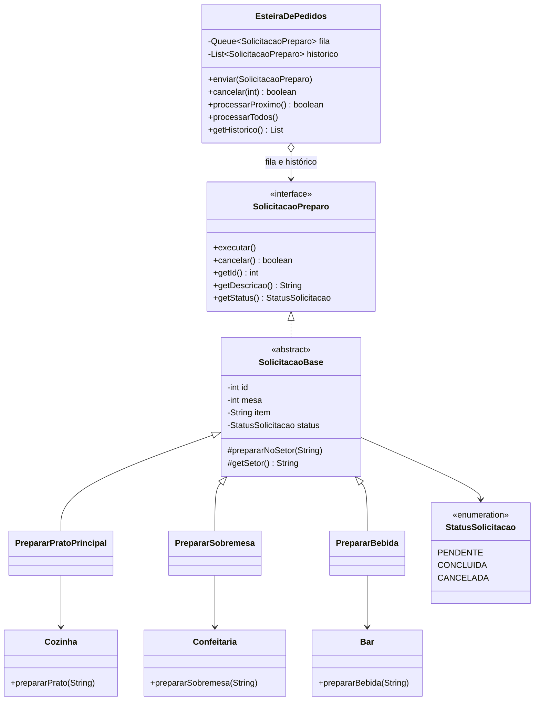
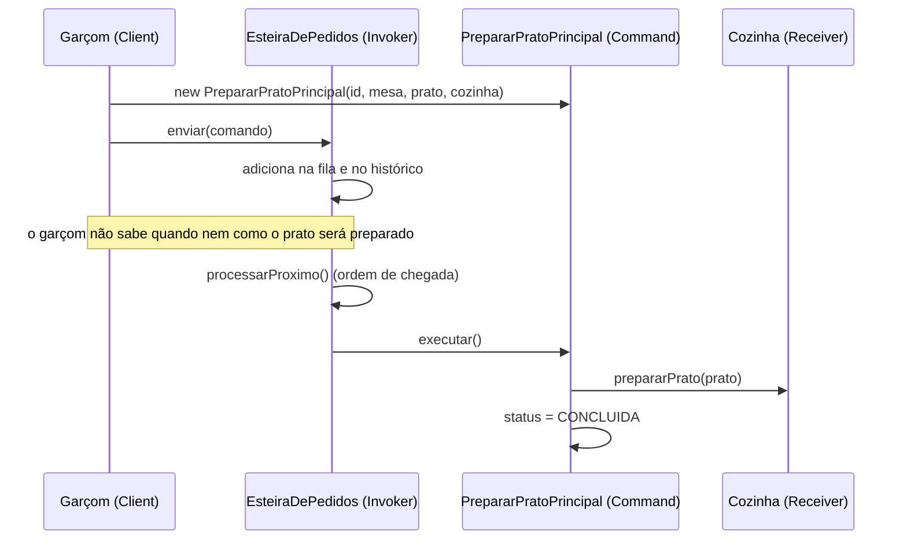

# Questão 4 — Gerenciamento de Pedidos de Restaurante (Command)

## 1. O problema

Um restaurante usa uma comanda eletrônica. Garçons ou clientes criam solicitações para a cozinha e para o bar (prato principal, sobremesa, bebida/coquetel).

Hoje, ao confirmar um pedido, a interface **invoca diretamente** os métodos das impressoras ou telas de cada setor (cozinha, bar, confeitaria):

```java
void confirmarPedido(Item item) {
    if (item.tipo == PRATO)      cozinha.imprimir(item);
    else if (item.tipo == BEBIDA) bar.exibirNaTela(item);
    else                          confeitaria.registrar(item);
}
```

Isso gera um **acoplamento direto** entre interface e setores, e impede uma fila única. As novas regras exigem:

- **Fila de execução:** processar os pedidos na ordem de chegada;
- **Cancelamento/estorno:** cancelar um pedido enviado por engano antes do início do preparo;
- **Histórico:** registrar todos os pedidos para conferência e fechamento da conta.

| Problema | Consequência |
|---|---|
| A interface conhece os detalhes de cada setor | Acoplamento forte |
| Chamada direta, sem representação do pedido como objeto | Impossível enfileirar, cancelar ou registrar histórico |
| Cada setor tem uma forma própria de receber o pedido | Não existe fila única |

## 2. Padrão identificado: **Command**

> *Encapsula uma solicitação como um objeto, permitindo parametrizar clientes com diferentes solicitações, enfileirar ou registrar solicitações e suportar operações que podem ser desfeitas.*

**Por que Command?** O próprio enunciado descreve as três capacidades clássicas do padrão: **enfileirar** (fila de execução), **cancelar/desfazer** (estorno) e **registrar** (histórico). Além disso, pede para **encapsular cada solicitação como objeto** e **desacoplar quem pede de quem executa**.

## 3. Papéis do padrão no código

| Papel no Command | Classe | Responsabilidade |
|---|---|---|
| **Command** (interface) | `SolicitacaoPreparo` | Contrato: `executar()`, `cancelar()`, `getStatus()`, `getDescricao()` |
| **Base dos comandos** | `SolicitacaoBase` | Centraliza id, mesa, item, status e a regra padronizada de cancelamento |
| **ConcreteCommand** | `PrepararPratoPrincipal`, `PrepararSobremesa`, `PrepararBebida` | Ligam a solicitação ao setor correto e sabem "o que chamar" nele |
| **Receiver** | `Cozinha`, `Confeitaria`, `Bar` | Sabem **como** preparar o item (a lógica real do trabalho) |
| **Invoker** | `EsteiraDePedidos` | Enfileira, executa, cancela e mantém o histórico. Só conhece a interface `Command` |
| **Client** | `RestauranteConsole` (o "garçom") | Cria os comandos e os entrega à esteira |

## 4. Diagrama de classes



## 5. Fluxo de execução



Passo a passo:

1. O garçom cria um **comando** (objeto que representa "preparar este item para esta mesa") e o envia à esteira com `enviar(...)`.
2. A esteira coloca o comando na **fila** (FIFO) e no **histórico**. Ela não sabe se é prato, bebida ou sobremesa: só enxerga `SolicitacaoPreparo`.
3. Quando um cozinheiro/barista libera, `processarProximo()` retira o primeiro da fila e chama `executar()`.
4. O comando **delega** ao receptor correto (`Cozinha`, `Bar` ou `Confeitaria`) e marca o status como `CONCLUIDA`.
5. Se um pedido foi enviado por engano, `cancelar(id)` o remove da fila **enquanto ainda está `PENDENTE`**.

## 6. Requisitos do enunciado × solução

| Requisito da tarefa | Como foi atendido |
|---|---|
| Encapsular cada solicitação de preparo como um objeto independente | Cada pedido é um objeto `SolicitacaoPreparo` com dados (mesa, item), estado e comportamento |
| Desacoplar quem faz o pedido de quem executa | O garçom só conhece `SolicitacaoPreparo` e `EsteiraDePedidos`. Cozinha, Bar e Confeitaria só são conhecidos pelos comandos concretos |
| Armazenar os pedidos em filas de espera para processamento sequencial | `Queue<SolicitacaoPreparo>` (`ArrayDeque`) em `EsteiraDePedidos`, processada em ordem de chegada |
| Permitir o cancelamento de forma padronizada | Método `cancelar()` na interface; a regra ("só antes do preparo") está em um único lugar, `SolicitacaoBase` |
| Histórico de todos os pedidos | Lista `historico` que guarda todo comando enviado, com o status final (`CONCLUIDA` ou `CANCELADA`) |
| Fila única de solicitações | A esteira trata todos os setores como `SolicitacaoPreparo`, então há uma só fila |

## 7. A regra de cancelamento

```java
public boolean cancelar() {
    if (status != StatusSolicitacao.PENDENTE) {
        return false;   // já preparado, concluído ou cancelado
    }
    status = StatusSolicitacao.CANCELADA;
    return true;
}
```

- A esteira só remove da fila se `cancelar()` retornar `true`.
- Um pedido já preparado **não** pode ser cancelado (`false`).
- Um pedido cancelado que ainda estivesse na fila **nunca seria executado**, pois `executar()` também confere o status.
- O pedido cancelado **permanece no histórico** com o status `CANCELADA`. Isso mantém a trilha de auditoria para o fechamento da conta.

## 8. Princípios de projeto aplicados

- **Baixo acoplamento:** interface e setores não se conhecem; o `Command` faz a ponte.
- **SRP:** o comando sabe *o que* pedir; o receptor sabe *como* fazer; a esteira sabe *quando* executar.
- **OCP:** novo tipo de solicitação = nova classe, sem alterar a esteira.
- **DIP:** a esteira depende da interface `SolicitacaoPreparo`.
- **DRY:** id, mesa, status e cancelamento ficam em `SolicitacaoBase`, sem repetição nos três comandos.

## 9. Como adicionar um novo tipo de solicitação (ex.: lanche na chapa)

```java
public class PrepararLanche extends SolicitacaoBase {
    private final Chapa chapa;
    public PrepararLanche(int id, int mesa, String lanche, Chapa chapa) {
        super(id, mesa, lanche);
        this.chapa = chapa;
    }
    protected void prepararNoSetor(String item) { chapa.grelhar(item); }
    protected String getSetor() { return "Chapa"; }
}
```

`EsteiraDePedidos` e o restante do sistema não precisam ser alterados.

## 10. Saída esperada (trecho)

```
Enfileirado: #1 | Mesa 5 | Cozinha | Risoto de cogumelos
Enfileirado: #2 | Mesa 5 | Bar | Caipirinha
...
-> Pedido #2 enviado por engano: cancelando antes do preparo
Cancelado: #2 | Mesa 5 | Bar | Caipirinha

-> Tentando cancelar #1 (ja preparado)
Pedido #1 nao pode ser cancelado (ja preparado ou inexistente).

Historico (para conferencia e fechamento da conta):
  #1 | Mesa 5 | Cozinha | Risoto de cogumelos | CONCLUIDA
  #2 | Mesa 5 | Bar | Caipirinha | CANCELADA
  #3 | Mesa 5 | Confeitaria | Petit gateau | CONCLUIDA
  #4 | Mesa 7 | Bar | Suco de laranja | CONCLUIDA
```

Executar somente esta questão: `java -cp target/classes br.edu.prova.apresentacao.Main 4`